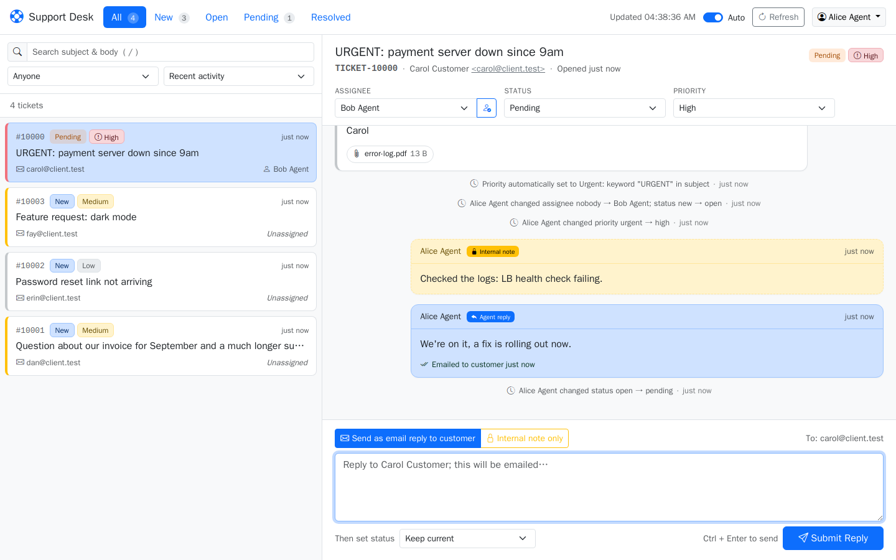
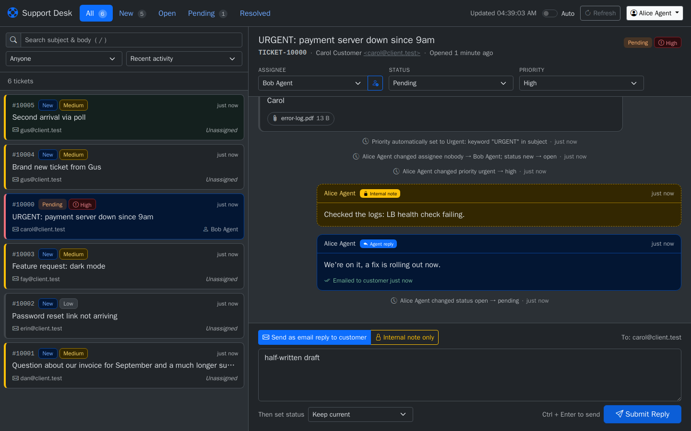
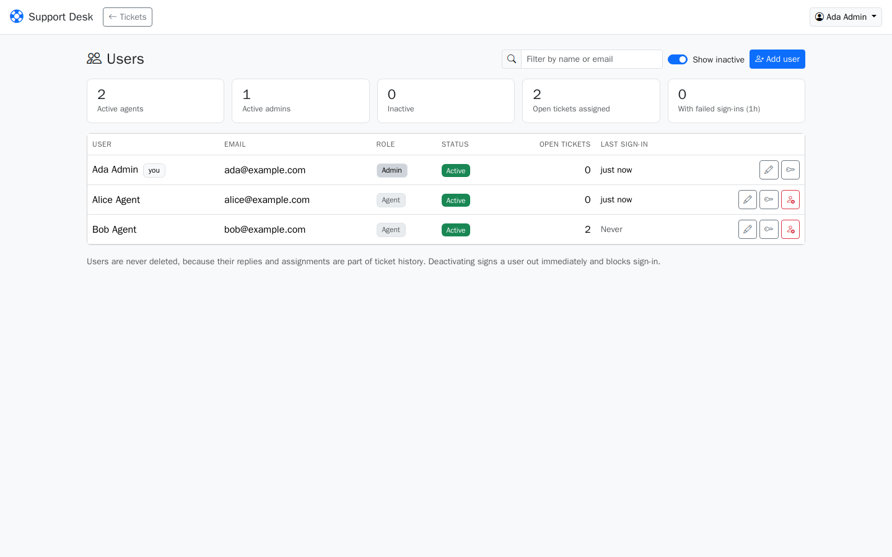
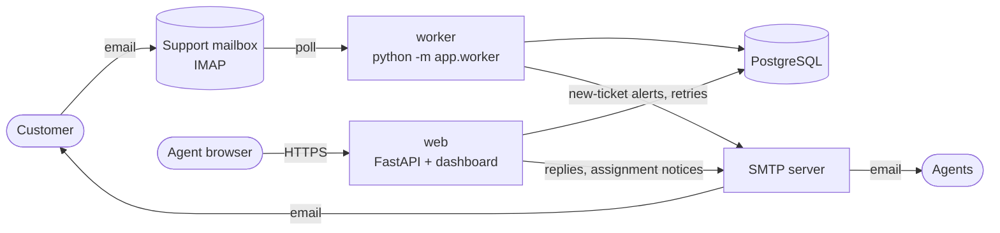

# Trouble Ticket System

A self-hosted, email-driven help desk. Customers email your support address; a
background worker turns each message into a ticket (or threads it onto an existing one),
alerts your agents, and agents answer from a web dashboard. Their replies go back to the
customer as normal email in the same thread.

Python · FastAPI · PostgreSQL · SQLAlchemy/Alembic · vanilla JS + Bootstrap · Docker Compose



<table>
  <tr>
    <td width="50%"></td>
    <td width="50%"></td>
  </tr>
  <tr>
    <td align="center"><em>Dark mode</em></td>
    <td align="center"><em>User administration</em></td>
  </tr>
</table>

---

## Contents

- [Features](#features)
- [Architecture](#architecture)
- [Quick start (local, with a bundled test mail server)](#quick-start)
- [Production deployment](#production-deployment)
- [Configuration reference](#configuration-reference)
- [Operations](#operations): logs, upgrades, backups, CLI
- [How it works](#how-it-works): threading, priorities, statuses, delivery
- [REST API](#rest-api)
- [Project layout](#project-layout)
- [Troubleshooting](#troubleshooting)

---

## Features

### Email ingestion
- **Any IMAP server.** Host, port, implicit TLS or STARTTLS are all configured through
  environment variables. The worker polls for unread mail and marks a message read only
  after it has been saved, so a crash never loses mail.
- **Smart threading.** Replies are matched to their ticket via `In-Reply-To` /
  `References` headers, or via the `[TICKET-10042]` tag in the subject, instead of
  opening duplicates. Quoted history ("On Monday … wrote:") is stripped from replies.
- **Safe parsing.** HTML is sanitized (scripts, styles and tracking images removed),
  plain text is preferred, and attachments are extracted and stored (20 MB limit per
  file by default).
- **Loop and spam protection.** Auto-replies, out-of-office messages, bounces, and mail
  from the support address itself are ignored.
- **Automatic priority.** New tickets start at *Medium*. Urgency keywords (URGENT,
  EMERGENCY, CRITICAL, OUTAGE, "server down", …) or a sender's "high importance" flag
  escalate them to *High* or *Urgent*. Negations such as "not urgent" don't count.
- **Poison-message quarantine.** A message that repeatedly fails to process is flagged
  in the mailbox and skipped, so it can't block everything behind it.

### Notifications (SMTP)
- **New-ticket alerts** go to every active agent. The priority leads the subject line
  (`[URGENT] New Ticket Created: …`), and the email has a colour-coded banner.
- **Customer acknowledgement** with their tracking number when a ticket is opened.
- **Agent replies** are emailed to the customer inside the original thread.
- **Assignment notices** go to an agent when a ticket is assigned to them.
- **Delivery with retry.** Temporary SMTP failures are retried with increasing delays
  (5 min, 10, 20, …); agents see "Sending", "Emailed", "Retrying" or "Not delivered"
  with a **Resend** button.

### Agent dashboard
- Split pane: the ticket queue on the left, the conversation on the right.
- Status tabs with live counts (All, New, Open, Pending, Resolved), plus filters for
  assignee, full-text search and sort order.
- Colour-coded status and priority badges.
- Change the assignee, status or priority straight from the ticket header. Every change
  is recorded in the ticket history.
- Reply to the customer by email, or add an **internal note** only agents can see,
  optionally setting the status in the same step. Ctrl+Enter sends.
- Auto-refresh every 30 seconds with new-ticket alerts, drafts kept per ticket,
  a direct link to every ticket, dark mode, and a layout that works on phones.

### Administration
- Roles: **Admin** and **Agent**.
- Admins add users (with a generated password), edit them, reset passwords, clear
  failed sign-ins, and deactivate or reactivate accounts. Deactivating can also return
  that person's open tickets to the Unassigned queue.
- Users are never deleted, so ticket history stays intact.

### Security
- Server-side sessions in an HttpOnly, SameSite cookie. Logging out or deactivating a
  user takes effect immediately.
- Passwords are hashed with Argon2id.
- Brute-force protection with separate limits per account + IP, per IP, and per account.
- Cross-site request protection, a strict Content-Security-Policy on the dashboard, and
  customer content always displayed as text, never as HTML.
- Attachments are always downloaded, never rendered in the browser.

---

## Architecture



Docker Compose runs four services from one image:

| Service   | Role |
|-----------|------|
| `db`      | PostgreSQL 17 (data in the `pgdata` volume) |
| `migrate` | Runs `alembic upgrade head` once, then exits. `web` and `worker` wait for it. |
| `web`     | FastAPI app: the REST API and the dashboard at `/` (port 8000) |
| `worker`  | Polls IMAP, creates tickets, sends alerts, retries failed replies, cleans up old data |
| `mail`    | *Optional, profile `mailtest`:* [GreenMail](https://greenmail-mail-test.github.io/greenmail/) test IMAP/SMTP server for local development |

Attachments live in the `attachments` volume, which `web` and `worker` share.

---

## Quick start

Try the whole system locally with the bundled test mail server. No real email account
is needed. Requires Docker with Compose v2.

```bash
git clone git@github.com:scroguard/trouble-ticket-system.git
cd trouble-ticket-system
cp .env.example .env
```

Edit `.env`:

1. Set `SECRET_KEY` to a random value:
   `python3 -c "import secrets; print(secrets.token_urlsafe(48))"`
2. Point mail at the bundled GreenMail server by uncommenting the block at the bottom
   of the file. The later values override the ones above them:

   ```ini
   IMAP_HOST=mail
   IMAP_PORT=3143
   IMAP_USE_SSL=false
   SMTP_HOST=mail
   SMTP_PORT=3025
   SMTP_USE_STARTTLS=false
   SMTP_USER=
   ```

Start everything:

```bash
docker compose --profile mailtest up -d --build
```

Open **http://localhost:8000**, click **First-time setup**, and create your admin account.

Send a test email as a "customer". GreenMail accepts mail for any address:

```bash
python3 - <<'EOF'
import smtplib
from email.message import EmailMessage
m = EmailMessage()
m["From"] = "Carol <carol@customer.test>"
m["To"] = "support@example.com"
m["Subject"] = "URGENT: checkout is down"
m.set_content("Customers get a 502 error at checkout.")
smtplib.SMTP("localhost", 3025).send_message(m)
EOF
```

Within a minute (`IMAP_POLL_INTERVAL`), the ticket appears in the dashboard as *Urgent*.
Replies you send land in GreenMail. To read them, point any mail client at IMAP
`localhost:3143` and sign in as `carol@customer.test` (GreenMail accepts any password).

> GreenMail keeps mail in memory: restarting the `mail` container empties every mailbox.

---

## Production deployment

### 1. Prerequisites

- A Linux host with Docker Engine and Docker Compose v2.
- A **dedicated mailbox** for support (e.g. `support@yourcompany.com`) that allows IMAP
  and SMTP sign-in with a username and password. The worker processes *every unread
  message* in `IMAP_MAILBOX` and marks it read, so don't point it at a personal inbox.
  - Many providers require an *app password* for IMAP/SMTP (e.g. Gmail with 2-step
    verification, Fastmail, iCloud).
  - Providers that only allow OAuth2 sign-in for IMAP/SMTP (e.g. Microsoft 365 /
    Exchange Online) aren't supported yet.
- A domain name and HTTPS in front of the app (a reverse proxy; see step 4).

### 2. Configure

```bash
git clone git@github.com:scroguard/trouble-ticket-system.git
cd trouble-ticket-system
cp .env.example .env
chmod 600 .env
```

At minimum, set these in `.env`:

| Setting | Notes |
|---|---|
| `APP_BASE_URL` | The exact public URL agents use, e.g. `https://support.example.com`. It's used for links in emails and for cross-site request protection, and `https://` enables Secure cookies. |
| `SECRET_KEY` | A long random string. |
| `POSTGRES_PASSWORD` **and** `DATABASE_URL` | Use the **same** strong password in both places. |
| `IMAP_*` | Your mailbox's server, port and TLS mode, plus sign-in details. |
| `SMTP_*` | Your outgoing server. `SMTP_FROM_ADDRESS` should be the support address, so customers' replies come back to the mailbox the worker reads. |
| `WEB_PORT` | `127.0.0.1:8000` when a reverse proxy runs on the same host (keeps the app off the public network). |
| `FORWARDED_ALLOW_IPS` | See step 4. |

The [configuration reference](#configuration-reference) lists every option.

### 3. Start

```bash
docker compose up -d --build
docker compose ps          # db/web/worker should become "healthy"; migrate "exited (0)"
```

Create the first admin, either in the browser (**First-time setup** on the sign-in page,
available only while no users exist) or from the command line:

```bash
docker compose run --rm web python -m app.cli create-user \
  --email admin@example.com --name "Your Name" --role admin
```

Then sign in, open **Admin**, and add your agents. New-ticket alerts go to every active
user with the *Agent* role.

### 4. HTTPS and a reverse proxy

Run the app behind a TLS-terminating proxy. Example using [Caddy](https://caddyserver.com/)
on the same host, which obtains certificates automatically:

```caddyfile
# /etc/caddy/Caddyfile
support.example.com {
    reverse_proxy 127.0.0.1:8000
}
```

With matching `.env` settings:

```ini
APP_BASE_URL=https://support.example.com
WEB_PORT=127.0.0.1:8000
# Trust X-Forwarded-For from the proxy so login rate limits see real client IPs.
# "*" is safe only because WEB_PORT is bound to 127.0.0.1 (only the proxy can reach it).
FORWARDED_ALLOW_IPS=*
```

Then `docker compose up -d` to apply them.

> **Important:** without `FORWARDED_ALLOW_IPS`, every request appears to come from the
> proxy's address, so the per-IP login limit could lock everyone out at once. If the
> app port is reachable from other machines, list the proxy's IP instead of `*`.

nginx, Traefik and others work the same way: forward to port 8000 and pass
`X-Forwarded-For`.

---

## Configuration reference

All settings are environment variables read from `.env`. **Bold** settings have no
default and must be set.

### Application

| Variable | Default | Description |
|---|---|---|
| `APP_BASE_URL` | `http://localhost:8000` | Public URL of the dashboard (email links, allowed origin, Secure cookies when `https://`) |
| **`SECRET_KEY`** | | Random string, at least 32 characters |
| `LOG_LEVEL` | `INFO` | `DEBUG`, `INFO`, `WARNING`, … |
| `WEB_PORT` | `8000` | Host port (or `ip:port`) the dashboard is published on |

### Database

| Variable | Default | Description |
|---|---|---|
| `POSTGRES_DB` / `POSTGRES_USER` / `POSTGRES_PASSWORD` | | Used by the `db` container to create the database |
| **`DATABASE_URL`** | | `postgresql+psycopg://USER:PASSWORD@db:5432/DB` (must match the values above) |

### Inbound mail (IMAP)

| Variable | Default | Description |
|---|---|---|
| **`IMAP_HOST`** | | IMAP server hostname |
| `IMAP_PORT` | `993` | `993` for implicit TLS, `143` for STARTTLS |
| `IMAP_USE_SSL` | `true` | Implicit TLS |
| `IMAP_USE_STARTTLS` | `false` | Upgrade a plain connection (can't be combined with `IMAP_USE_SSL`) |
| **`IMAP_USER`** / **`IMAP_PASSWORD`** | | Mailbox sign-in |
| `IMAP_MAILBOX` | `INBOX` | Folder to poll |
| `IMAP_POLL_INTERVAL` | `60` | Seconds between polls (backs off automatically while the server is failing) |
| `IMAP_TIMEOUT` | `30` | Network timeout in seconds |
| `IMAP_BATCH_SIZE` | `50` | Maximum messages per poll |
| `IMAP_MAX_FAILURES` | `3` | Failed processing attempts before a message is flagged and skipped |

### Outbound mail (SMTP)

| Variable | Default | Description |
|---|---|---|
| **`SMTP_HOST`** | | SMTP server hostname |
| `SMTP_PORT` | `587` | `587` for STARTTLS, `465` for implicit TLS |
| `SMTP_USE_SSL` | `false` | Implicit TLS |
| `SMTP_USE_STARTTLS` | `true` | STARTTLS (can't be combined with `SMTP_USE_SSL`) |
| `SMTP_USER` / `SMTP_PASSWORD` | | Leave `SMTP_USER` empty for servers that don't need sign-in |
| **`SMTP_FROM_ADDRESS`** | | Sender address; should be the support mailbox |
| `SMTP_FROM_NAME` | `Support` | Sender display name |
| `SMTP_TIMEOUT` | `30` | Network timeout in seconds |
| `EMAIL_MAX_RETRIES` | `4` | Immediate reconnect attempts for IMAP/SMTP network errors |
| `EMAIL_RETRY_BASE_DELAY` / `EMAIL_RETRY_MAX_DELAY` | `2` / `60` | Backoff between those attempts, in seconds |

### Tickets and delivery

| Variable | Default | Description |
|---|---|---|
| `PRIORITY_ESCALATION_ENABLED` | `true` | Keyword-based priority escalation for new tickets |
| `REPLY_MAX_ATTEMPTS` | `6` | Delivery attempts for an agent reply before it's marked *Not delivered* |
| `REPLY_RETRY_BASE_SECONDS` | `300` | First retry delay; doubles each time (capped at 6 h) |
| `REPLY_PENDING_TIMEOUT_SECONDS` | `600` | The worker picks up replies stuck in "sending" this long (e.g. after a restart) |
| `ATTACHMENT_DIR` | `/data/attachments` | Attachment storage inside the containers (the `attachments` volume) |
| `ATTACHMENT_MAX_BYTES` | `20971520` | Larger attachments are skipped |

### Sign-in and security

| Variable | Default | Description |
|---|---|---|
| `SESSION_TTL_HOURS` | `12` | How long a sign-in lasts |
| `SESSION_COOKIE_SECURE` | *(auto)* | Defaults to `true` when `APP_BASE_URL` starts with `https://` |
| `LOGIN_MAX_ATTEMPTS` | `5` | Failed sign-ins per account + IP within the window |
| `LOGIN_LOCKOUT_MINUTES` | `15` | Window length for the two limits on this line and the one above |
| `LOGIN_MAX_ATTEMPTS_PER_IP` | `20` | Failed sign-ins per IP (any account) within the window |
| `LOGIN_MAX_ATTEMPTS_PER_ACCOUNT` | `50` | Failed sign-ins per account per hour, from all IPs combined |
| `FORWARDED_ALLOW_IPS` | `127.0.0.1` | Proxies whose `X-Forwarded-For` header is trusted (read by uvicorn) |
| `TRUSTED_ORIGINS` | | Extra comma-separated origins allowed to make changes from a browser |

---

## Operations

### Logs and health

```bash
docker compose ps                     # health of every service
docker compose logs -f worker         # ingestion, alerts, retries
docker compose logs -f web            # API requests and errors
curl -fsS http://localhost:8000/healthz
```

The worker reports *unhealthy* if it hasn't completed a successful IMAP poll for 15
minutes. Check its logs for sign-in or connection errors.

### Upgrading

```bash
git pull
docker compose up -d --build
```

The `migrate` service applies any database migrations before `web` and `worker` restart.

### Backups

Back up **both** the database and the attachments volume:

```bash
# Database
docker compose exec -T db sh -c 'pg_dump -U "$POSTGRES_USER" -Fc "$POSTGRES_DB"' > tickets-$(date +%F).dump

# Attachments
docker run --rm -v tickets_attachments:/data:ro -v "$PWD":/backup alpine \
  tar czf /backup/attachments-$(date +%F).tgz -C /data .
```

Restore:

```bash
docker compose stop web worker
docker compose exec -T db sh -c 'pg_restore -U "$POSTGRES_USER" -d "$POSTGRES_DB" --clean --if-exists' < tickets-YYYY-MM-DD.dump
docker run --rm -v tickets_attachments:/data -v "$PWD":/backup alpine \
  tar xzf /backup/attachments-YYYY-MM-DD.tgz -C /data
docker compose start web worker
```

### Command-line tools

```bash
# Create a user (prompts for the password if --password is omitted)
docker compose run --rm web python -m app.cli create-user --email a@example.com --name "Ann" --role agent

# Recovery: set a password, reactivate the account, clear its failed sign-ins,
# and sign it out everywhere (e.g. when no admin can sign in)
docker compose run --rm web python -m app.cli set-password --email a@example.com
```

---

## How it works

### Ticket threading

For each unread email the worker decides, in order:

1. **Header match:** `In-Reply-To` or `References` points to a message the system knows
   (the email that opened a ticket, a customer reply, or a reply an agent sent) → added
   to that ticket.
2. **Subject tag:** the subject contains `[TICKET-n]` **and** the sender is that
   ticket's customer or an active staff member → added to that ticket. A tag from anyone
   else opens a new ticket, so strangers can't post into other people's tickets.
3. Otherwise → **new ticket**.

Staff replying to a ticket by email (e.g. to an alert) are stored as internal notes. A customer reply reopens a
*Pending*, *Resolved* or *Closed* ticket. Duplicate deliveries (same `Message-ID`) are
ignored.

### Statuses

| Status | Meaning |
|---|---|
| `new` | Just arrived; nobody has touched it. Moves to *open* automatically on assign, claim or comment. |
| `open` / `in_progress` | Being worked on |
| `pending` | Waiting for the customer; their reply moves it back to *open* |
| `resolved` / `closed` | Done; a customer reply reopens it |

### Priority escalation (new email tickets)

| Signal | Priority |
|---|---|
| URGENT, EMERGENCY, CRITICAL, OUTAGE, SEV1/P1 or "*X* is down" (site, server, VPN, …) in the **subject** | **Urgent** |
| The same words in the first 2,000 characters of the **body** | **High** |
| ASAP, IMPORTANT, "high priority" or DOWN in the subject | **High** |
| Sender marked the email high importance | **High** |
| Sender marked it low importance (and no keywords) | **Low** |
| Otherwise | **Medium** |

The reason is recorded as an internal note on the ticket, e.g. *Priority automatically
set to Urgent: keyword "URGENT" in subject*. Replies never change an existing ticket's
priority.

### Reply delivery

An agent's reply is saved first, then emailed in the background, so a slow mail server
never holds up the dashboard.

- **Temporary failures** (server unreachable, 4xx responses) are retried by the worker
  with doubling delays, up to `REPLY_MAX_ATTEMPTS`.
- **Permanent rejections** (5xx responses) fail immediately.
- **Resend** keeps the original `Message-ID`, so the customer's thread stays intact.

---

## REST API

The dashboard uses a JSON API that you can also call directly. Interactive docs are at
**`/docs`** (Swagger UI) on your server.

- **Authentication:** `POST /auth/login` sets the session cookie and also returns an
  `access_token` for scripts (`Authorization: Bearer <token>`).
- **Errors:** always `{"error": "...", "details": [...]}` with the matching HTTP status
  (400, 401, 403, 404, 409, 429).

| Method & path | Who | Purpose |
|---|---|---|
| `POST /auth/register` | admin (anyone while no users exist) | Create a user |
| `POST /auth/login` · `POST /auth/logout` · `GET /auth/me` | | Session management |
| `POST /auth/change-password` | signed-in user | Change your own password |
| `GET /api/tickets` | agent | List tickets. Filters: `status` (repeatable), `priority`, `assigned_to` (`me`, `none`, or a user id), `q` (search), `sort`, `limit`, `offset` |
| `GET /api/tickets/{id}` | agent | Ticket with full history and attachments |
| `PATCH /api/tickets/{id}` | agent | Change `status`, `priority` or `assigned_to` (emails the new assignee) |
| `POST /api/tickets/{id}/claim` | agent | Assign an unassigned ticket to yourself (409 if someone else owns it) |
| `POST /api/tickets/{id}/comments` | agent | Public reply (emailed) or internal note (`is_internal: true`); optional `status` |
| `POST /api/tickets/{id}/comments/{cid}/resend` | agent | Retry a reply that failed to send |
| `GET /api/attachments/{id}` | agent | Download an attachment |
| `GET /api/users` · `GET /api/users/{id}` | agent | User directory |
| `PATCH /api/users/{id}` | admin | Edit name, email, role or active status |
| `POST /api/users/{id}/password` | admin | Set a new password (signs the user out everywhere) |
| `POST /api/users/{id}/unlock` | admin | Clear failed sign-in attempts |
| `GET /api/admin/users` | admin | Users with open-ticket counts and recent failed sign-ins |
| `GET /healthz` | anyone | Health check |

Example:

```bash
curl -s -X POST http://localhost:8000/auth/login \
  -H 'Content-Type: application/json' \
  -d '{"email":"admin@example.com","password":"…"}' | jq -r .access_token > token

curl -s "http://localhost:8000/api/tickets?status=new&priority=urgent" \
  -H "Authorization: Bearer $(cat token)" | jq '.items[] | {id, subject, priority}'
```

---

## Project layout

```
├── app/
│   ├── main.py            # FastAPI app: routes, security headers, dashboard
│   ├── auth.py            # sign-in, sessions, rate limiting, /auth routes
│   ├── tickets.py         # ticket, comment and attachment routes
│   ├── users.py           # user directory and admin routes
│   ├── email_service.py   # IMAP polling, parsing/sanitizing, SMTP, email templates
│   ├── ingestion.py       # email → ticket/comment (threading rules)
│   ├── notifications.py   # background sending with retry
│   ├── worker.py          # worker loop: poll, retry replies, housekeeping
│   ├── models.py          # SQLAlchemy models
│   ├── schemas.py         # API request/response models
│   ├── config.py          # settings (environment variables)
│   ├── cli.py             # create-user / set-password
│   └── static/            # dashboard: index.html, app.js, app.css, theme.js
├── migrations/            # Alembic database migrations
├── docs/screenshots/
├── docker-compose.yml
├── Dockerfile
├── .env.example
└── requirements.txt
```

---

## Troubleshooting

| Symptom | Fix |
|---|---|
| Changes fail with **"Cross-origin request rejected"** | The URL in the browser doesn't match `APP_BASE_URL`. Fix it, or add the other origin to `TRUSTED_ORIGINS`. |
| Signing in seems to work, but you're immediately signed out again | `APP_BASE_URL` is `https://` (so cookies are Secure) but you're browsing over `http://`. Use HTTPS, or set `SESSION_COOKIE_SECURE=false` for testing only. |
| No tickets appear | `docker compose logs worker`. Look for IMAP sign-in or TLS errors, and check the mail is **unread** and in `IMAP_MAILBOX`. |
| Customer replies open new tickets | The reply lost both its headers and the `[TICKET-n]` subject tag, or came from a different address than the original. |
| Everyone gets "Too many failed login attempts" | Behind a proxy without `FORWARDED_ALLOW_IPS`, all users share the proxy's IP. See [step 4](#4-https-and-a-reverse-proxy). |
| Locked out of every admin account | `docker compose run --rm web python -m app.cli set-password --email you@example.com` |
| An agent reply shows **Not delivered** | Hover over it for the server's error, fix the SMTP settings or recipient, then click **Resend**. |
